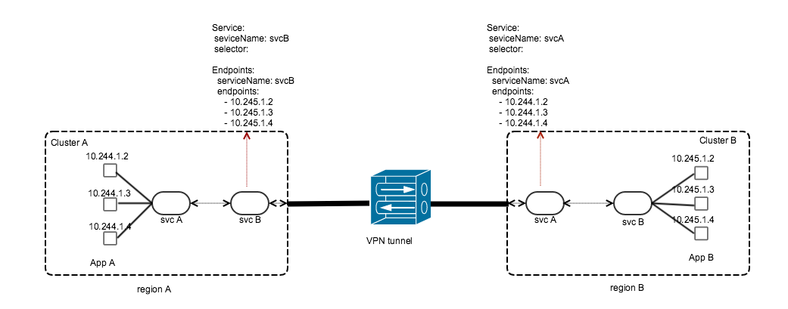

# k8s-endpoints-sync-controller

## Overview
This controller deployed on each connected Kubernetes cluster replicates the Kubernetes service and endpoints objects across clusters so that services can be discovered and enables communication across clusters using Kubernetes service names.

The communication across clusters relies on kube-proxy to update the iptable rules on each node as the controller creates/updates the API objects.

### Prerequisites

* All the clusters should have different clusterCIDR.
* All the clusters should be connected so that there is Pod to Pod connectivity across clusters. This can be achieved using 
    1) VPN across clusters with L3 routing if using Kubenet network plugin. 
    2) On AWS, VPC peering between two EKS clusters
    3) on GKE, https://istio.io/docs/examples/multicluster/gke/
    4) on IBM cloud, https://istio.io/docs/examples/multicluster/icp/ 
* The Kubernetes API Server of every cluster should be reachable to other clusters.

### Build & Run

1. Install Go 1.9 or higher version
2. Install Glide
3. checkout the project onto the GOPATH
4. run *glide up* -> to import all the dependencies
3. run *make build* -> to build the binary
4. run *make buildimage TAG=<image_name:version>* -> to build the Docker image

The executable expects kubeconfig files of the clusters to connect mounted at /etc/kubeconfigs to run in the cluster. \
The following environment variables can be set
1. NSTOWATCH - Array of namespaces in which services and endpoints objects will be watched and replicated. (Default: all)
2. EXCLUDE - Array of namespaces in which objects will not be replicated. (Default: ) 

## Documentation

Assuming the pod IP addresses are routable across clusters, the goal is to enable communication through K8s service objects i.e. App A in region A should talk to app B in region B using app B's K8s service name and vice-versa.
This is achieved by creating in cluster A:
1. app B service object (headed/headless) without pod selectors 
2. endpoints object with endpoints as IP addresses of app B pods in cluster B. 

This enables kube-proxy in cluster A to load balance requests on the service name of app B to app B's pods.

### Annotations for Service Migration
The controller provides annotation features for the service teams to migrate services across clusters with no downtime. 
The following describes how to use these annotations when migrating a service from source cluster to target cluster. 

 **Annotation Key: vmware.com/syndicate-mode** \
 **Annoration Values: {source, receiver, singular}**

Before migration the service is replicated from source cluster to target cluster i.e the service obj in the source cluster will have the selector but the replicated service obj in the target cluster will not have selector and the endpoints obj in that cluster is maintained by the controller. After migration, the service is replicated from target cluster to source cluster.

##### Migrating K8s service obj with selector for stateful services
After deploying new pods in target cluster and completing the data migration, 
1. Add annotation 'receiver' in the source cluster. This should update the service obj in the target cluster with annotation 'source'. Also, the controller will remove the selector from the service in the source cluster and the replication will now happen from target→source cluster.
2. Update the service obj in the target cluster with right selector.

##### Migrating K8s service obj with selector for stateless services
After deploying new pods in target cluster, 
1. Add annotation 'union' in the source cluster. This will remove the selector from the service obj in source cluster and updates endpoints object in both clusters with union of pod ipaddresses( old ips + new ips). This ensures that the request for the service will be served by any of the pod in both clusters.
2. Update the service obj in target cluster with 'source' annotation. This should update the service obj in the source cluster with annotation 'receiver' and the replication will now happen from target→source cluster.
3. Update the service obj in the target cluster with right selector if needed.

##### Stop replicating K8s service & endpoints object
1. Update the service obj in any cluster with annotation 'singular'. This will stop replicating that service and will remove replicated svc obj and endpoints obj.
Creating service obj in any cluster with annotation 'singular' will also not create replicated objects. 

## Releases & Major Branches

## Contributing

The k8s-endpoints-sync-controller project team welcomes contributions from the community. Before you start working with k8s-endpoints-sync-controller, please read our [Developer Certificate of Origin](https://cla.vmware.com/dco). All contributions to this repository must be signed as described on that page. Your signature certifies that you wrote the patch or have the right to pass it on as an open-source patch. For more detailed information, refer to [CONTRIBUTING.md](CONTRIBUTING.md).

## License

Permission is hereby granted, free of charge, to any person obtaining a copy of this software and associated documentation files (the "Software"), to deal in the Software without restriction, including without limitation the rights to use, copy, modify, merge, publish, distribute, sublicense, and/or sell copies of the Software, and to permit persons to whom the Software is furnished to do so, subject to the following conditions:

The above copyright notice and this permission notice shall be included in all copies or substantial portions of the Software.

THE SOFTWARE IS PROVIDED "AS IS", WITHOUT WARRANTY OF ANY KIND, EXPRESS OR IMPLIED, INCLUDING BUT NOT LIMITED TO THE WARRANTIES OF MERCHANTABILITY, FITNESS FOR A PARTICULAR PURPOSE AND NONINFRINGEMENT. IN NO EVENT SHALL THE AUTHORS OR COPYRIGHT HOLDERS BE LIABLE FOR ANY CLAIM, DAMAGES OR OTHER LIABILITY, WHETHER IN AN ACTION OF CONTRACT, TORT OR OTHERWISE, ARISING FROM, OUT OF OR IN CONNECTION WITH THE SOFTWARE OR THE USE OR OTHER DEALINGS IN THE SOFTWARE.
